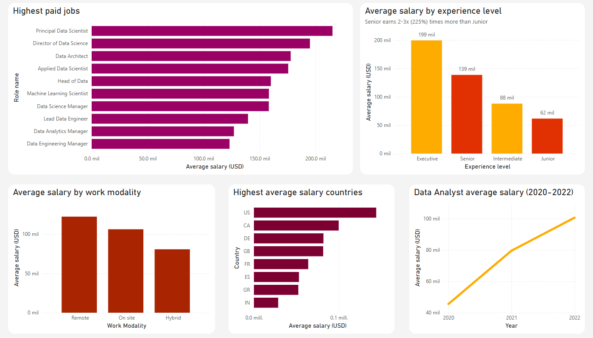

# Data Science Salaries Analysis (SQL Server)

## 🎯 Objective
Analyze public data on data science salaries to uncover trends related to:
- Experience level
- Work modality
- Role
- Country

## 🧰 Tools
- SQL Server Developer Edition
- SSMS for T-SQL queries
- Power BI Desktop for visualization

## 🗂 Dataset
Source: [Kaggle – Data Science Job Salaries 2023](https://www.kaggle.com/datasets/ruchi798/data-science-job-salaries)  

## 📊 Questions
- How much higher is the average salary for a senior-level job compared to a junior-level one?
- Top 3 countries by average salary.
- Which are the 3 highest paid roles?
- Which work modality has the highest average salary?
- What is the average salary for a Data Analyst?
- Has it changed from year to year? How much?

## 📈 Insights
- Senior roles earn 2-3 times (225%) more than Junior roles.
- The United States, Canada and Germany have the highest average salaries (in descending order).
- Principal Data Scientist, Director of Data Science and Data Architect top the salary list.
- Fully remote roles tend to pay higher.
- The average salary for a Data Analyst is 92893.06 USD.
- Yes, it has increased from year to year. 174.55% from 2020 to 2021, and 126.47% from 2021 to 2022.

##  Visuals
A dashboard with visuals was made using Power BI Desktop, where each one of them presents one or more insights in a clear way.

